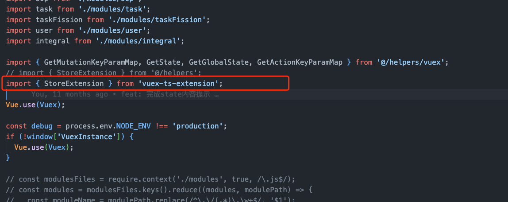
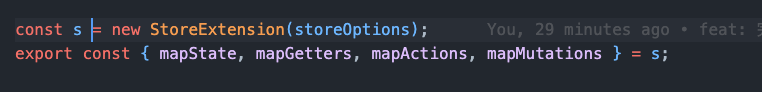
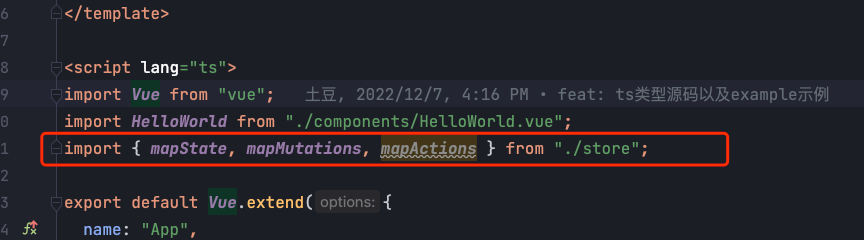
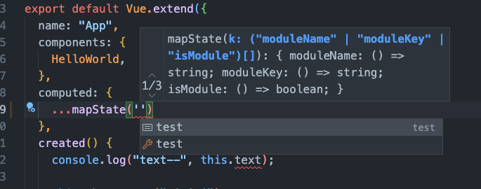
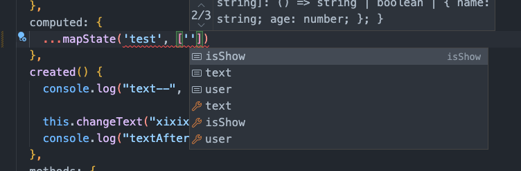
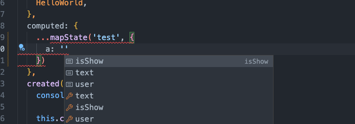
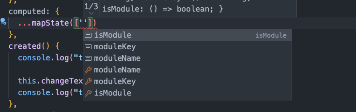
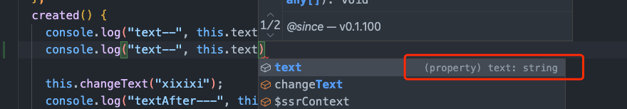

# vuex-ts-extension
基于有些浏览器不支持vuex的操作提示，此插件可智能提示各状态和方法，且支持区分namespaced配置

### map函数导入
通常在store.js的store初始化文件中，导入该插件

然后导出如下几个方法


### map辅助函数使用步骤
1. 从store文件导入所需要的辅助函数

2. 直接使用,支持多种vuex支持的方式
- 支持namespaced




- 不支持namespaced
- 

**其他用法皆为map辅助函数的用法，不同是使用时有提示**

### 检验所定义变量类型


###示例
```javascript
import Vue from "vue";
import Vuex from "vuex";
import { StoreExtension } from 'vuex-ts-extension'

Vue.use(Vuex);

const storeOptions = {
    state: {} as any,
    mutations: {} as any,
    actions: {} as any,
    modules: {
        test,
        noNamed,
    },
};

const storeInstance = new StoreExtension(storeOptions);
export const { mapState, mapGetters, mapActions, mapMutations } = storeInstance;
```

```javascript
import { mapState, mapMutations, mapActions } from "./store";

export default Vue.extend({
  name: "App",
  components: {
    HelloWorld,
  },
  computed: {
    ...mapState("test", ["isShow", "text"]),
    ...mapState(["isModule"]),
  },
  created() {
    console.log("text--", this.text);
    this.changeText("xixixi");
    console.log("textAfter---", this.text);
    console.log("isModule");

    this.changeModuleAsync("123");
  },
  methods: {
    ...mapMutations("test", ["changeText"]),
    ...mapActions(["changeModuleAsync"]),
  },
});
```
